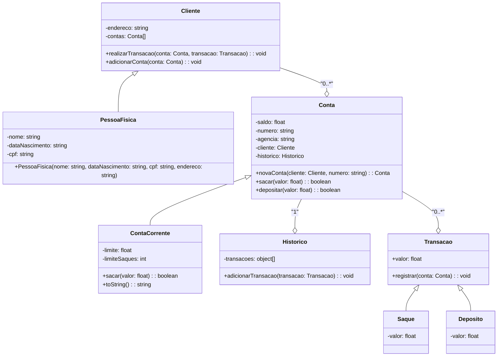

# Em andamento...

## Diagrama de Classes

```mermaid
classDiagram
  class Cliente {
    -endereco: string
    -contas: Conta[]
    +realizarTransacao(conta: Conta, transacao: Transacao): void
    +adicionarConta(conta: Conta): void
  }

  class PessoaFisica {
    -nome: string
    -dataNascimento: string
    -cpf: string
    +PessoaFisica(nome: string, dataNascimento: string, cpf: string, endereco: string)
  }

  class Conta {
    -saldo: float
    -numero: string
    -agencia: string
    -cliente: Cliente
    -historico: Historico
    +novaConta(cliente: Cliente, numero: string): Conta
    +sacar(valor: float): boolean
    +depositar(valor: float): boolean
  }

  class ContaCorrente {
    -limite: float
    -limiteSaques: int
    +sacar(valor: float): boolean
    +toString(): string
  }

  class Historico {
    -transacoes: object[]
    +adicionarTransacao(transacao: Transacao): void
  }

  class Transacao {
    +valor: float
    +registrar(conta: Conta): void
  }

  class Saque {
    -valor: float
  }

  class Deposito {
    -valor: float
  }

  Cliente --o Conta : "0..*"
  Cliente <|-- PessoaFisica
  Conta <|-- ContaCorrente
  Conta --o Historico : "1"
  Conta --o Transacao : "0..*"
  Transacao <|-- Saque
  Transacao <|-- Deposito


```